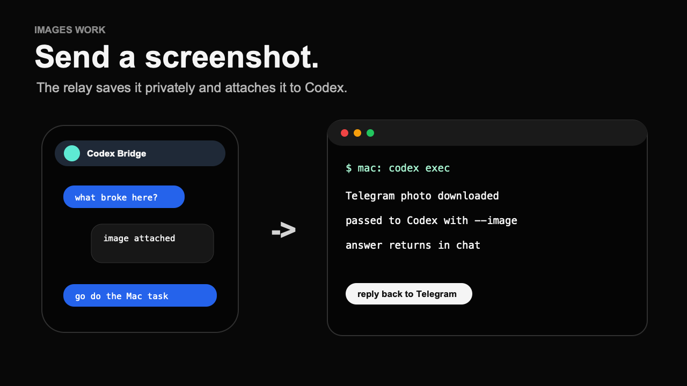
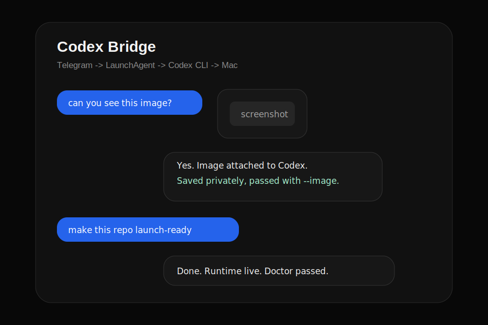

# Codex Relay

[](https://github.com/dicnunz/codex-relay/actions/workflows/ci.yml)

**Text your Mac. Codex works.**

A Telegram DM becomes a local Codex run on your Mac. The phone is the remote. The Mac keeps the files, tools, apps, sandbox, and account context. When Codex finishes, the answer comes back to Telegram.

No web dashboard. No hosted relay account. No screen mirror.

<p align="center">
  <a href="assets/codex-relay-demo.mp4">
    
  </a>
</p>

**Watch first:** [52-second demo](assets/codex-relay-demo.mp4) · [Install](#install) · [Try it and report the first blocker](docs/builder-feedback.md) · [Security](#security)

> Unofficial project. Not affiliated with OpenAI or Telegram.

## The Product

```text
Telegram DM -> LaunchAgent -> Codex CLI -> your Mac -> Telegram reply
```

Use it when a task belongs on your Mac but you are not at the keyboard:

- ask Codex to inspect a repo while you are away
- send a screenshot and ask what changed
- run a small doc, test, or fix pass in a known folder
- request the current Mac screen with `/screenshot`
- check jobs, health, policy, and recent run receipts from your phone

Codex Relay does not mirror the visible Codex desktop chat UI. It calls your local Codex CLI with your configured model, workdir, sandbox, approval mode, and optional image attachment.

## Install

Requirements:

- macOS
- Codex Mac app installed and signed in
- Telegram account
- dedicated Telegram bot token from `@BotFather`
- Python 3 available as `python3`

```bash
git clone https://github.com/dicnunz/codex-relay.git
cd codex-relay
./scripts/install.sh
```

The installer verifies the bot token, gives you a one-time `/start` code, allow-lists your private Telegram DM, installs the LaunchAgent, and runs `doctor.sh`.

If token verification fails with `CERTIFICATE_VERIFY_FAILED`, rerun after fixing Python's CA bundle:

```bash
open "/Applications/Python 3.x/Install Certificates.command"
```

Codex Relay also retries Telegram HTTPS calls with the active Python CA path, `certifi` when installed, and common macOS/Homebrew CA bundles. On managed networks that use HTTPS inspection, set `CODEX_RELAY_CA_FILE=/path/to/your-ca.pem` in `.env` instead of disabling TLS verification.


### Optional Gemini Assist

After the first install, you can enable the Gemini mobile harness powered by Flash 3.1 Lite from Telegram, so the phone setup does not require opening the Mac:

```text
/gemini key YOUR_GEMINI_API_KEY
```

The relay saves the key privately, enables natural commands and answer polish, and reloads the setting in the running process. It also attempts to delete the Telegram message that contained the key. `/gemini on`, `/gemini off`, and `/gemini clear` can manage it later.

You can still configure it manually in `.env`:

```bash
CODEX_RELAY_GEMINI_API_KEY=your-gemini-api-key
CODEX_RELAY_GEMINI_MODEL=gemini-3.1-flash-lite-preview
CODEX_RELAY_GEMINI_MAX_OUTPUT_TOKENS=4096
CODEX_RELAY_GEMINI_NATURAL_COMMANDS=true
CODEX_RELAY_GEMINI_POLISH=true
```

Then run:

```bash
./scripts/install_launch_agent.sh
```

With Gemini assist enabled, natural messages can map to relay actions before Codex runs. For example, `set my dir to /code/codex-relay and run a security audit` can set the active folder and start a Codex audit job. Codex still performs the repo work; Gemini only plans safe relay actions and optionally rewrites Codex's final answer to be easier to read on a phone. Gemini API key setup is handled by the relay before Codex sees the message; other messages that look like tokens, passwords, private keys, or `.env` content bypass Gemini. Use `/gemini` in Telegram to check the status.

Then DM your bot:

```text
/alive
/health
/policy
/screenshot
/tools
/latency
send a screenshot and ask what changed
```

Optional Mac control surface:

```bash
./scripts/menu_bar.sh
```

That opens a small native menu-bar controller for status, doctor, restart, update, and copying first-run Telegram commands.

## Demo Without Secrets

Run the no-token path from a clean checkout:

```bash
./scripts/demo.sh
./scripts/fresh_clone_test.sh
```

The demo proves the repo can run its smoke path without a Telegram token, local `.env`, or private runtime state. Regenerate the sanitized launch video with:

```bash
./scripts/record_demo.sh
```

<p align="center">
  
</p>

## What You Can Send

```text
/alive        live route, model, folder, uptime
/status       current thread and runtime config
/health       fast local bridge checks, no Codex run
/policy      safety boundary and allowed surface
/screenshot   send the Mac screen back to Telegram
/latency      last Codex run timing and timeout
/jobs         running jobs and last run
/cancel id    stop a running job
/history      recent run receipts, no prompt/response logs
/activity     running jobs, pending queue, terminals, safe history
/automations  inspect Codex automations through Codex
/tools        quick Codex tool probe
/recover      run local relay recovery
/try          useful first prompts
/new name     new Codex thread
/use name     switch threads
/list         list threads
/where        show active folder
/cd path      set active folder
/home         set folder to ~
/think mode   set Codex thinking mode for this thread
/queue        show or add pending requests
/forget id    remove pending request
/forgetphotos remove saved images from pending requests
/terminal     persistent interactive terminal sessions
/file path    send a local file back to Telegram
/brief        terse replies for this thread
/verbose      detailed replies for this thread
/update       show local update command
/gemini       optional mobile assist status/setup
/reset        clear the current Codex session
/ping         bridge check
```

Normal messages go to the active thread. If the thread is busy, normal messages and downloaded image attachments are queued and start when the active job clears. Captions on Telegram images become the prompt; image files are saved privately and attached to Codex. Telegram photo albums are batched into one Codex job with up to `CODEX_TELEGRAM_MAX_IMAGES_PER_MESSAGE` images.

Thinking modes are `low`, `medium`, `high`, and `xhigh`. `/think default` returns a thread to the configured default. Queue, image cleanup, file transfer, terminal sessions, recovery, and thinking-mode commands all work without Gemini. With Gemini assist enabled, natural messages can route to those same slash-command capabilities.

Terminal sessions are PTY-backed and persist while the relay process is running: `/terminal open setup -- gh auth login`, `/terminal read setup`, `/terminal enter setup yes`, and `/terminal kill setup`. File transfer uses `/file path` from the active thread folder and blocks obvious secret/runtime files by default.

## Try It

I am looking for 10 real Mac/Codex users to try the first install path and report the first blocker.

Open the feedback form after a real attempt:

```text
https://github.com/dicnunz/codex-relay/issues/new?template=install-feedback.yml
```

The ask is simple: install it, run `/alive`, `/health`, `/policy`, `/screenshot`, try one safe local task, and report what was confusing or broken. Do not paste bot tokens, `.env`, private screenshots, personal files, raw Codex transcripts, or unredacted logs.

Normal messages use `CODEX_TELEGRAM_MODEL`, `CODEX_TELEGRAM_THINKING_MODE`, and `CODEX_TELEGRAM_SPEED` from `.env`. The sample config defaults to `gpt-5.5`, `xhigh`, and `standard`; change those only if you intentionally want a different reasoning profile.

`/status` shows the active model settings, last run status, and latency after Codex replies.

## What It Is Not

| It is | It is not |
| --- | --- |
| A private Telegram remote for local Codex on your Mac | An official OpenAI app |
| A macOS LaunchAgent that calls the Codex app CLI | A hosted agent platform |
| A way to send tasks, images, repo work, and local Mac requests from your phone | A VNC screen mirror |
| A small local bridge with allow-listed Telegram access | A bypass for logins, MFA, limits, or confirmations |

## Verify

```bash
python3 -m py_compile codex_relay.py scripts/configure.py
python3 scripts/smoke_test.py
./scripts/demo.sh
./scripts/fresh_clone_test.sh
```

After real install:

```bash
./scripts/doctor.sh
./scripts/status.sh
./scripts/status_ui.sh
```

Use `doctor.sh` as the pass/fail install check. Use `status.sh` for diagnostics. `doctor.sh` checks the Mac environment, Codex CLI, local config, LaunchAgent, runtime copy, screenshot permission, Python syntax, and smoke tests.

If `/screenshot` says macOS could not create an image from the display, grant Screen Recording access on the Mac: System Settings > Privacy & Security > Screen & System Audio Recording. Allow Terminal/Codex or the app that installed Codex Relay, then rerun `./scripts/doctor.sh`.

`status_ui.sh` opens a private local status page generated from `status.sh`. `menu_bar.sh` builds and opens the optional native macOS menu-bar controller. `fresh_clone_test.sh` clones the repo into a temp folder and proves the no-secrets demo path works from a clean checkout.

Runtime files:

```text
~/Library/Application Support/CodexRelay
~/Library/LaunchAgents/com.codexrelay.agent.plist
```

Update later with:

```bash
./scripts/update.sh
```

Stop the LaunchAgent with:

```bash
./scripts/uninstall.sh
```

Runtime files remain under `~/Library/Application Support/CodexRelay` unless you remove them separately.

## Security

Codex Relay is intentionally powerful. If you expose your Telegram bot, you are exposing a path to Codex on your Mac.

- Use a dedicated bot and keep the token private.
- `.env` is private and gitignored.
- Runtime config is copied with `0600` permissions.
- Only the allow-listed Telegram user/chat can run Codex.
- Group chats are disabled unless `CODEX_TELEGRAM_ALLOW_GROUP_CHATS=true`.
- Images are stored in the private runtime state directory and pruned by retention settings.
- `/policy` shows the same boundary inside Telegram.
- High-risk actions can still hit Codex, OpenAI, macOS, browser, or site confirmations.
- It cannot bypass logins, MFA, macOS privacy prompts, site safety barriers, account limits, or mandatory confirmations.

Use it only with a Telegram account and Mac you trust.

## Honest Limits

- It uses your normal Codex/OpenAI account limits.
- Telegram and Codex/OpenAI are still in the path; this only avoids adding another hosted relay server.
- It waits for Codex to finish before sending the final answer.
- A `/ping` is immediate; real repo, browser, image, test-running, and desktop/app-control tasks can take tens of seconds or minutes.
- Computer Use and plugin behavior depend on what your local Codex runtime exposes.
- The bot is only as capable as the Codex install on that Mac.

Codex is already useful on a Mac. Codex Relay makes it reachable from the chat app already on your phone.
